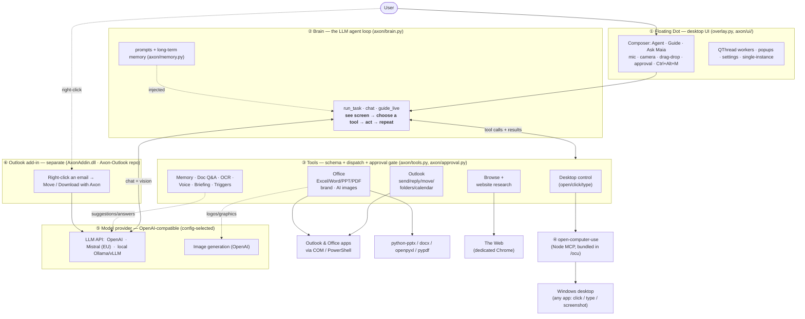

# Axon intelligence — Architecture

Axon is a Windows desktop assistant: a floating **dot** you talk to, an LLM **brain** that decides
what to do, a set of **tools** it can call, and the **hands** (open‑computer‑use) that actually drive
the screen. Office and Outlook are driven directly through Windows COM. A separate **Outlook add‑in**
adds right‑click email filing. The brain can run on OpenAI, Mistral, or a fully local model — it's the
same OpenAI‑compatible protocol, chosen by config.

## Diagram

## How it works

### ① The dot (UI)
A frameless always‑on‑top dot (PySide6). Click it for the **composer**, which has three modes:
- **Agent** — "do this for me" (it controls apps).
- **Guide** — "show me how" (on‑screen highlights, step by step).
- **Ask Maia** — plain chat with memory.

Plus an **Ask/Auto** approval toggle, a **camera** (screenshot → ask about it), a **mic** (voice input),
**drag‑and‑drop** a file onto it, and a global **Ctrl+Alt+M** hotkey (file the selected Outlook email).
Long work runs on background QThread **workers** so the UI never freezes; **popups** handle approvals
and folder picks.

### ② The brain (the loop)
This is the part that makes it agentic — the same idea as Claude Code/Cursor:
1. The model is given the goal + (for Agent/Guide) a **screenshot** of the screen.
2. It **chooses a tool** to call (or answers).
3. We run the tool and feed the **result** back.
4. Repeat until the goal is met.

Before any state‑changing action (send email, move, delete…), an **approval gate** can pause for the
user's OK. Known facts about the user (**long‑term memory**) are injected into the prompt each turn.

### ③ The tools
One registry (`axon/tools.py`) exposes ~70 tools to the model and routes each call:
- **Desktop control** — open/close apps, and (fallback) click/type via the hands.
- **Outlook** — send/reply/forward, move/delete, folders, calendar, signature, rules.
- **Office** — read **and** edit Excel/Word/PowerPoint/PDF (Cursor‑style), brand presets, AI images.
- **Browse** — a dedicated Chrome + a navigation agent + whole‑site research.
- **Knowledge & more** — memory, document Q&A over a folder, OCR, voice, daily briefing, email triggers.

### ④ The hands
For arbitrary apps, **open‑computer‑use** (a bundled Node process) performs real OS actions —
`get_app_state` (accessibility tree + screenshot), click, type. Office/Outlook/files are driven the
**reliable** way instead: **COM/PowerShell** and the Python document libraries (python‑pptx, docx,
openpyxl, pypdf) — no fragile UI clicking.

### ⑤ The model provider (swappable)
Every LLM call goes through one **OpenAI‑compatible** client, so the provider is just config:
- **OpenAI** (default, baked key) — highest quality.
- **Mistral** (EU‑hosted) — privacy‑friendlier cloud; use `pixtral-large-latest` for Agent/Guide (vision).
- **Local** (Ollama/vLLM on a company server) — **$0 per call, data never leaves the network**; best for
  light tasks (suggestions/chat). The Agent's vision + tool use needs a strong model (frontier cloud, or
  a large multimodal model on a GPU box). Image generation is OpenAI‑only.

### ⑥ The Outlook add‑in (independent)
A managed COM add‑in (`AxonAddin.dll`) that adds **right‑click → Move / Download with Axon**. It calls
the **same OpenAI‑compatible API** directly for folder suggestions — so it works with the dot's baked
key **or** a fully on‑site model. It's shipped both bundled with the dot and as a standalone repo
(`Axon-Outlook`).

### Packaging
PyInstaller builds the dot into `AxonIntelligence.exe`; the **hands** (`/ocu`) and a baked `.env` key are
bundled; an **Inno Setup** installer registers the add‑in and creates shortcuts. `build.bat` does it all
in one command. Result: users double‑click one installer — no API key entry, no setup.

## Example: "Research dimplesteel.com and email me a one‑page report"
1. Composer (Agent) → **brain**.
2. Brain calls **research_website** → **browse** drives Chrome page by page.
3. Brain composes the report, calls **send_email** → **Outlook via COM** (drafts, you approve, sends).
4. Status streams back to the dot; the email opens on your monitor.
