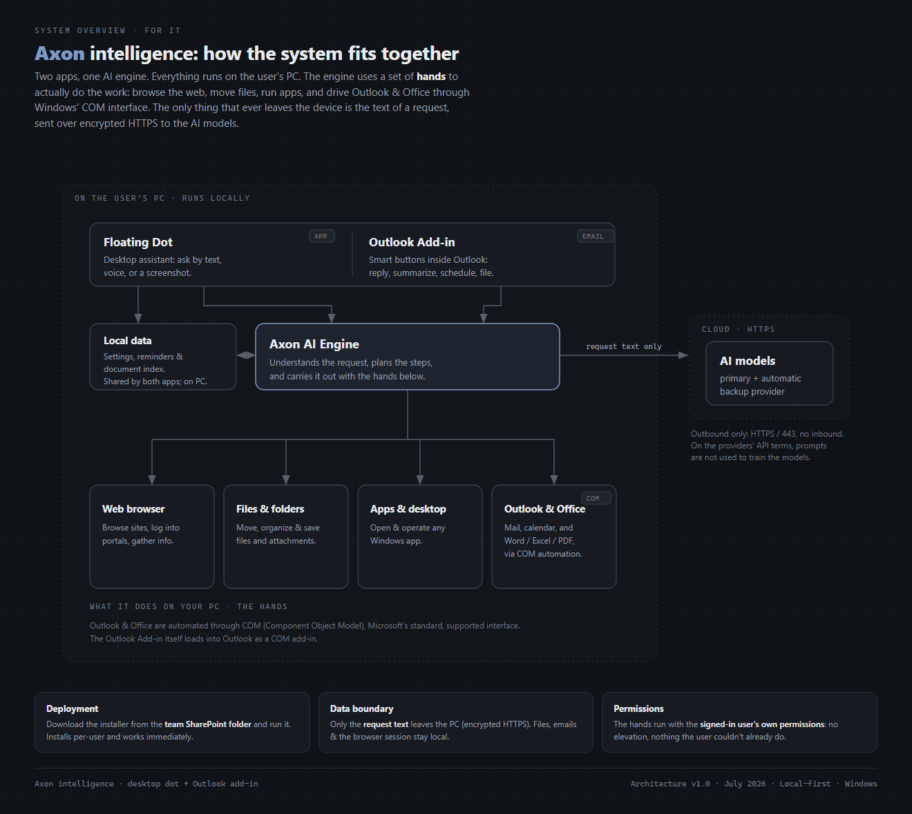

# Axon intelligence: system architecture

*A one-page overview for IT. Architecture v1.0 · July 2026.*

Two apps, one AI engine. Everything runs on the user's PC. The engine uses a set of **hands** to
actually do the work: browse the web, move files, run apps, and drive Outlook & Office through
Windows' COM interface. The only thing that ever leaves the device is the text of a request, sent
over encrypted HTTPS to the AI models.

> An interactive version of this diagram is in [`architecture.html`](architecture.html)
> (open it in a browser, or enable GitHub Pages to view it online).

## How it works

**On the user's PC (runs locally)**

- **The two apps** — a **Floating Dot** (a desktop assistant you ask by text, voice, or a screenshot)
  and an **Outlook Add-in** (smart buttons inside Outlook for reply, summarize, schedule, and file).
- **Axon AI Engine** — understands the request, plans the steps, and carries it out with the hands below.
- **Local data** — settings, reminders, and a private index of your documents. Shared by both apps and
  stays on the PC.

**The hands (what it does on the PC)**

| Hand | What it does |
| --- | --- |
| **Web browser** | Browse sites, log into portals, gather info. |
| **Files & folders** | Move, organize, and save files and email attachments. |
| **Apps & desktop** | Open and operate any Windows app. |
| **Outlook & Office** | Mail, calendar, and Word / Excel / PDF, via COM automation. |

Outlook & Office are automated through **COM (Component Object Model)**, Microsoft's standard,
supported interface. The Outlook Add-in itself loads into Outlook as a COM add-in.

**Cloud (HTTPS)**

- **AI models** — a primary provider with an automatic backup. Reached over **HTTPS / 443, outbound
  only, with no inbound connections.** On the providers' API terms, prompts are not used to train the
  models.

## Notes for IT

- **Deployment** — Download the installer from the team SharePoint folder and run it. Installs per-user
  and works immediately.
- **Data boundary** — Only the request text leaves the PC (encrypted HTTPS). Files, emails, and the
  browser session stay local.
- **Permissions** — The hands run with the signed-in user's own permissions: no elevation, nothing the
  user couldn't already do.
